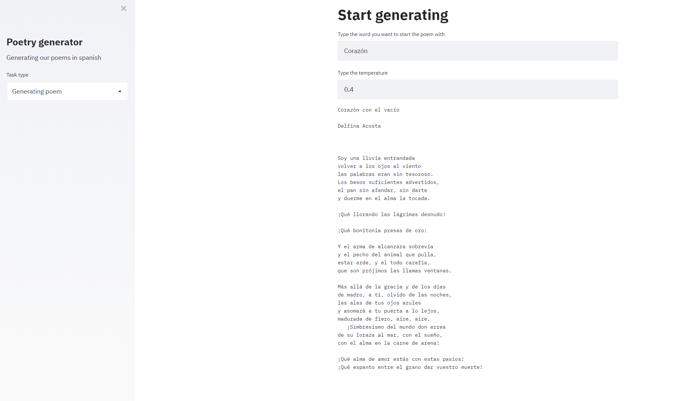

# poesIA: a poetry generator in Spanish 📚📚💻
A poetry generator from a scrapped corpus of Spanish poetry. EDA and general NLP tasks are included.

## Poem genetator 📚🤯
Here a visualization of the generator performance with streamlit. Given some words.... it generates a beautiful poem in Spanish✨✨✨✨

## Exploratory Data Analysis 🔎🔎

We generated an overview of the whole data. We analyze the scope and length of the vocabulary involved, generating some nice visualizations ☁️☁️☁️

We decided to make some word counts as well as search for relations between authors and poems in the whole dataset 📈

We also took into account specific authors and established some comparisons. We detected relations between textual data such as antithesis and polysemy. Awesome isn't it? 🤩

An embedding model was build to detect polysemy, similar words, and common word collocations in poetry. So many word relations in poems!

.

Also, Voronoi graphs were made...📈📈📈📈

.

## Relevant codes
- [Script for scrapping the data](poetry-scrapper.py): script that generates a .csv files with the poems scraped from the blog entries of a Spanish poetry webpage (link to the webpage [here](https://www.poemas-del-alma.com)).

- [Poem generator visualization (Streamlit)](generating_poems.py): poems generator code using streamlit.

### notebooks

- [EDA of the poetry dataset](notebooks/data exploration.ipynb): Exploratory Data Analysis of the dataset, including a basic NLP complete task!

- [Poem genetator code](notebooks/poetry generator.ipynb): code to generate synthetic poems with a RNN.

* **Recommended**: open the notebooks in [Colaboratory](https://colab.research.google.com/github/andreamorgar/poesIA/blob/master/).

## Talks

This project has been presented as a talk in the [PyConEs 2020 (Pandemic Edition)](https://2020.es.pycon.org/). You can find the [slides](slides.pdf) in this repo and the [video](https://www.youtube.com/watch?v=0C96vAa9NHY&t) in youtube.
