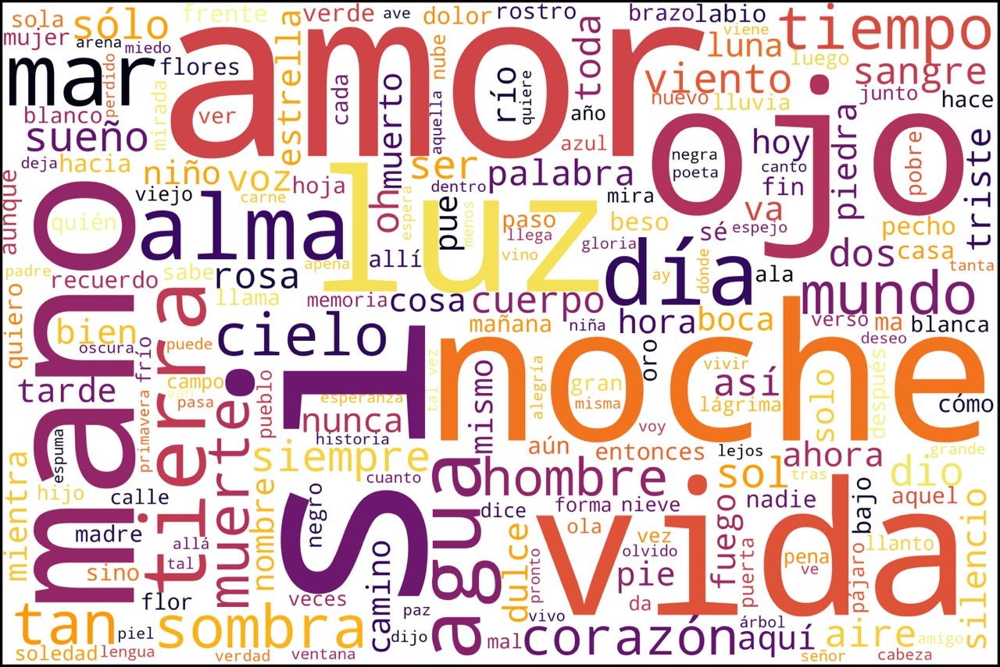
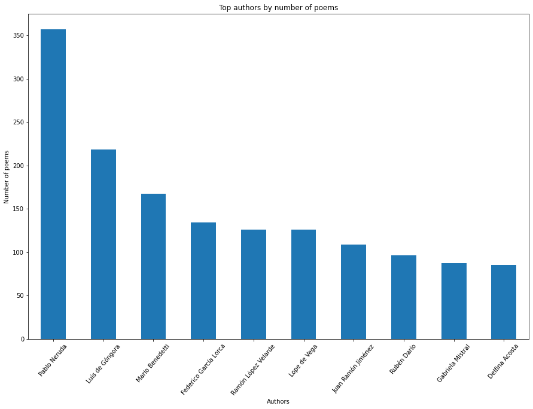
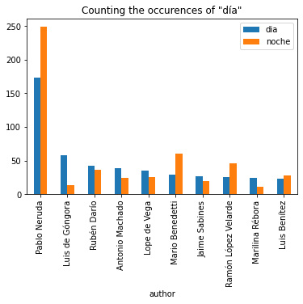
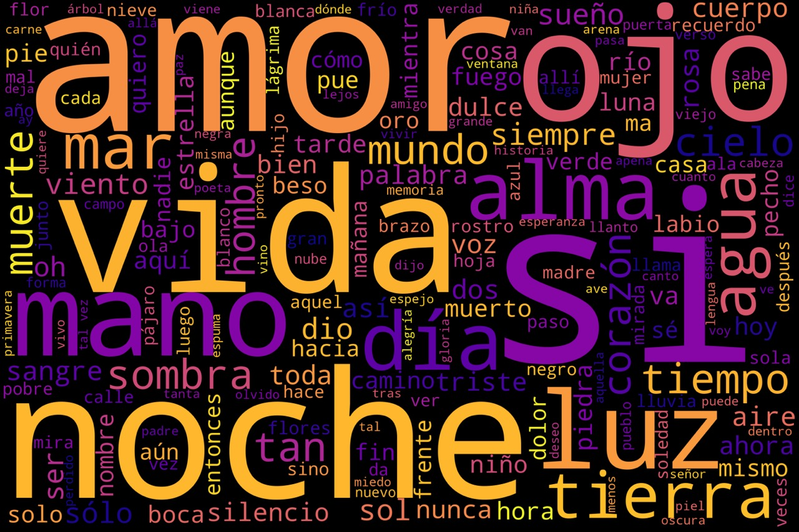
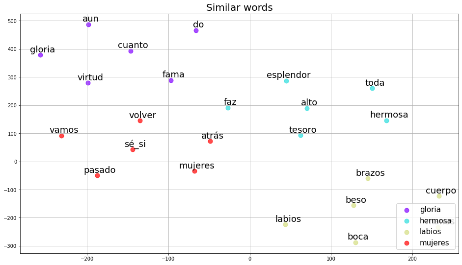
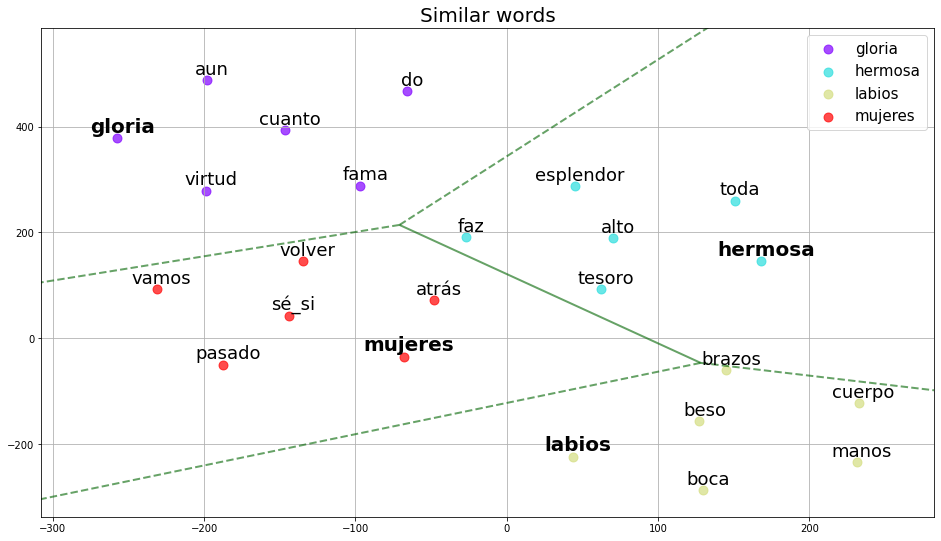

# poesIA: a poetry generator in Spanish 📚📚💻
A poetry generator from a scrapped corpus of Spanish poetry. EDA and general NLP tasks are included. 

## Exploratory Data Analysis 🔎🔎

We decided to make some word counts as well as search for relations between authors and poems in the whole dataset 📈

We also took into account specific authors and established some comparisons. We detected relations between textual data such as antithesis and polysemy. Awesome isn't it? 🤩

We generated an overview of the whole data. We analysis the scope and length of the vocabulary involved, generating some visualizations ☁️☁️☁️

An embedding model was build to detect polysemy, similar words, and common word collocations in poetry. So many word relations in poems!

.

Also, Voronoi graphs were made...📈📈📈📈

.

## Relevant codes
- [Script for scrapping the data](https://github.com/andreamorgar/poesIA/blob/master/poetry-scrapper.py): script that generates a .csv files with the poems scraped from the blog entries of a Spanish poetry webpage (link to the webpage [here](https://www.poemas-del-alma.com))

